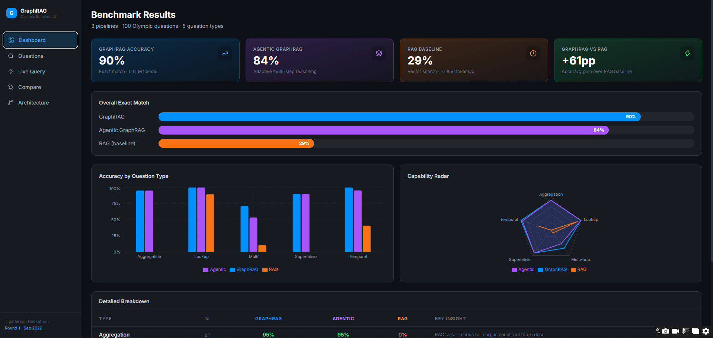
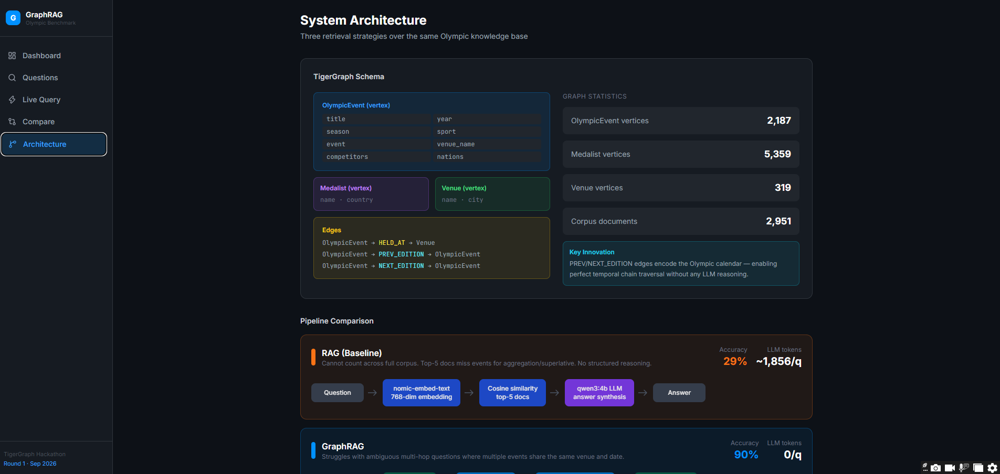
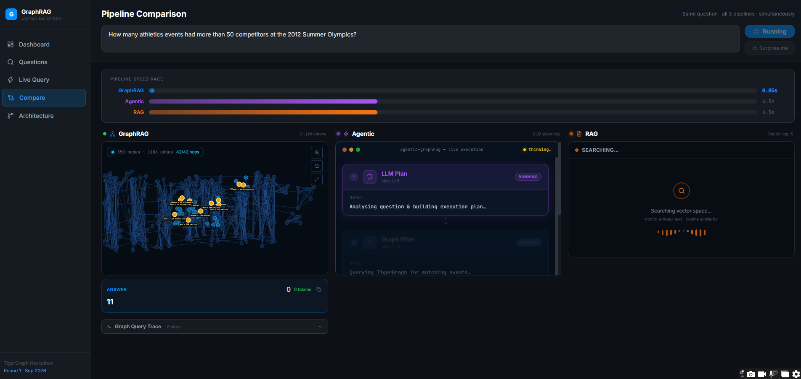

# TigerGraph Agentic GraphRAG — Olympic Events Benchmark

Built for the TigerGraph Agentic GraphRAG Hackathon, September 2026.

A system that answers questions about Olympic events using three different retrieval architectures — RAG, GraphRAG, and Agentic GraphRAG — benchmarked head-to-head on 100 evaluation questions, with a full web interface that lets you run live queries and watch each pipeline reason through the answer in real time.

---

## Benchmark Results

| Pipeline | Exact Match | Contains Gold | Avg LLM Tokens |
|---|---|---|---|
| RAG (baseline) | 29% | 43% | ~1,856/q |
| GraphRAG | **90%** | **90%** | **0** |
| Agentic GraphRAG | **84%** | **84%** | ~0/q |

### By Question Type

| Type | Questions | RAG | GraphRAG | Agentic |
|---|---|---|---|---|
| aggregation | 21 | 0% | 95.2% | 95.2% |
| lookup | 19 | 89.5% | 100% | 100% |
| superlative | 10 | 0% | 90.0% | 90.0% |
| temporal | 22 | 40.9% | 100% | 95.5% |
| multi_hop | 28 | 10.7% | 71.4% | 53.6% |
| **Overall** | **100** | **29%** | **90%** | **84%** |



GraphRAG achieves 90% exact match with zero LLM tokens. RAG scores zero on aggregation and superlative questions because top-5 retrieval can never count or rank across the full corpus — the graph can, instantly, across all 2,187 events.

---

## The Three Pipelines

### RAG — the baseline

Vector similarity search over 2,951 Wikipedia articles. Embeds the question with `nomic-embed-text`, retrieves the top 5 most similar documents, passes them to `qwen3:4b`, and generates an answer. Works for simple lookups. Fails completely on any question that requires counting, ranking, or reasoning across more than 5 documents.

### GraphRAG — structured traversal, no LLM

```
Question
  -> extract entities (year, season, sport, venue, date, threshold)
  -> TigerGraph REST++ vertex filter
  -> edge traversal (PREV/NEXT_EDITION for temporal, HELD_AT for multi-hop)
  -> read structured attribute (gold medalist, competitor count, nation count)
  -> return answer directly
```

No LLM involved. The graph encodes exactly what the questions ask about, so traversal replaces both retrieval and reasoning. Aggregation is a filter + count. Temporal questions are a two-hop edge traversal. Lookup is a direct attribute read. Result: 90% exact match, 0 tokens, most queries answered in under one second.

### Agentic GraphRAG — adaptive multi-step reasoning

```
Question
  -> qwen3:4b produces a structured plan (year, season, sport, direction, threshold...)
  -> regex enrichment fills any plan fields the LLM missed
  -> adaptive tool execution:
       graph_filter, count_results, sort_results, follow_edge,
       infobox_lookup, venue_date_filter, vector_search
  -> answer synthesized from evidence chain
  -> if answer missing: retry with vector-augmented graph search
  -> if still missing: pure vector fallback
```

The agent evaluates evidence at each step and decides what to do next — not a fixed pipeline. It handles edge cases that pure graph traversal misses, at the cost of higher latency.

---

## The Knowledge Graph

Hosted on TigerGraph Savanna 4.2.5, graph name: `OlympicsGraph`.



**Vertices**

| Type | Count | What it represents |
|---|---|---|
| OlympicEvent | 2,187 | One per event — "Athletics at the 2016 Summer Olympics – Men's 100 metres" |
| Medalist | 5,359 | Gold, silver, bronze medalists with name and country |
| Venue | 319 | Competition venues |

**Edges**

| Type | Meaning |
|---|---|
| GOLD_MEDAL / SILVER_MEDAL / BRONZE_MEDAL | Links an event to its medalists |
| HELD_AT | Links an event to its venue |
| PREV_EDITION / NEXT_EDITION | Temporal chain — links each event to the same event at the prior/next Olympics |

The PREV/NEXT_EDITION edges are what make temporal questions trivial. "Who won gold in event X at the Olympics immediately before 2010?" is two REST++ calls: find the anchor event, traverse one PREV_EDITION edge, read the gold medalist attribute.

---

## The Web Interface

A React + Vite frontend with five pages, powered by a live FastAPI backend connected to TigerGraph.

### Dashboard

Benchmark overview showing exact match accuracy for all three pipelines, a per-question-type bar chart, a capability radar, and a detailed breakdown table. All numbers come from the actual results JSON — nothing hardcoded.

### Questions Explorer

Browse all 100 benchmark questions with the gold answer and predicted answers from all three pipelines side by side, with pass/fail indicators per question per pipeline.

### Live Query

Ask any Olympic question and watch the answer computed in real time.


For GraphRAG: the visualization above shows the actual TigerGraph knowledge graph loaded live from Savanna — real vertices, real edges. Ask a question and watch it traverse: nodes light up as it filters by sport and year, edges highlight as it hops between events, and the answer node turns gold. A collapsible Graph Query Trace panel shows every REST++ operation that ran — SOURCE, FILTER, EDGE, INFOBOX, RETURN — with the actual endpoint called.

For Agentic: a step-by-step tool call trace animates as the agent runs — each tool call with its input, output, and status.

For RAG: retrieved documents appear as ranked cards with staggered animation.

A "Surprise me" button picks a random example and fires it automatically.

### Compare

Fires all three pipelines simultaneously against the same question and shows them side by side.



A speed race bar tracks each pipeline's elapsed time independently as they run. GraphRAG answered in 0.05 seconds in the screenshot above. Agentic and RAG are still running. Each column shows that pipeline's live visualization. Once all three finish, answers appear with their elapsed times and token usage for direct comparison.

### Architecture

Pipeline architecture diagrams, graph schema with vertex and edge types, and live statistics pulled directly from TigerGraph.

---

## Project Structure

```
├── pipelines/
│   ├── shared.py                # Corpus, EmbeddingIndex, llm_call, make_result
│   ├── graphrag_pipeline.py     # Pipeline 2: entity extraction + graph traversal
│   ├── agentic_pipeline.py      # Pipeline 3: LLM planner + adaptive tool execution
│   └── rag_pipeline.py          # Pipeline 1: vector similarity baseline
│
├── backend/
│   └── main.py                  # FastAPI: /api/query, /api/results, /api/graph
│
├── frontend/src/
│   ├── pages/
│   │   ├── Dashboard.jsx        # Benchmark overview
│   │   ├── QuestionExplorer.jsx # Browse all 100 questions
│   │   ├── LiveQuery.jsx        # Live query with per-pipeline visualization
│   │   ├── Compare.jsx          # Side-by-side parallel pipeline comparison
│   │   └── Architecture.jsx     # Diagrams and live graph stats
│   └── components/
│       ├── NetworkViz.jsx        # Cytoscape.js traversal animation
│       ├── AgenticViz.jsx        # Agent step-by-step trace
│       └── RAGViz.jsx            # Document retrieval cards
│
├── embed_documents.py           # Build 768-dim nomic embedding matrix (one-time)
├── load_graph.py                # Load vertices + edges into TigerGraph (one-time)
├── tg_client.py                 # TigerGraph REST++ client (JWT auth + retry)
├── compare_benchmarks.py        # Generate comparison table and HTML report
├── schema.gsql                  # TigerGraph schema definition
└── results/                     # Benchmark output JSON files
```

---

## Setup

### Prerequisites

- Python 3.12+
- Node.js 18+
- [Ollama](https://ollama.com/) running locally
- TigerGraph Savanna account — free tier at [savanna.tigergraph.com](https://savanna.tigergraph.com)

### Install

```bash
# Python dependencies
pip install requests numpy ollama python-dotenv fastapi uvicorn

# Frontend dependencies
cd frontend && npm install
```

### Configure

Create `.env` in the project root:

```
TG_HOST=https://your-instance.i.tgcloud.io
TG_GRAPH=OlympicsGraph
TG_SECRET=your_secret_here
TG_USERNAME=tigergraph
```

### One-time data setup

```bash
ollama pull nomic-embed-text
ollama pull qwen3:4b

python embed_documents.py   # build embedding index (~15 min)
python load_graph.py        # load vertices + edges into TigerGraph (~5 min)
```

### Run benchmarks

```bash
python -m pipelines.graphrag_pipeline
python -m pipelines.agentic_pipeline
python -m pipelines.rag_pipeline
python compare_benchmarks.py
```

### Run the web UI

```bash
# Terminal 1 — backend
python -m uvicorn backend.main:app --port 8000 --reload

# Terminal 2 — frontend
cd frontend && npm run dev
```

Open [http://localhost:5173](http://localhost:5173).

---

## Models

| Model | Purpose | Size |
|---|---|---|
| `nomic-embed-text` | Document and query embeddings (768-dim) | 137M |
| `qwen3:4b` | Agentic planning, synthesis, RAG answers | 4B |

All inference runs locally via Ollama. GraphRAG uses zero LLM calls — the graph answers directly.

---

*TigerGraph Agentic GraphRAG Hackathon — September 2026*
